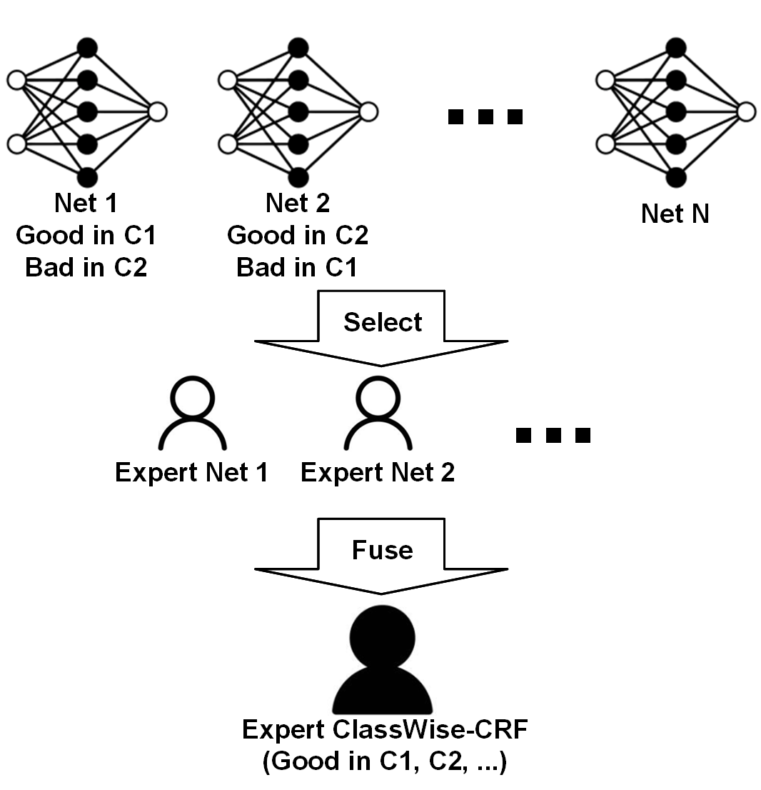
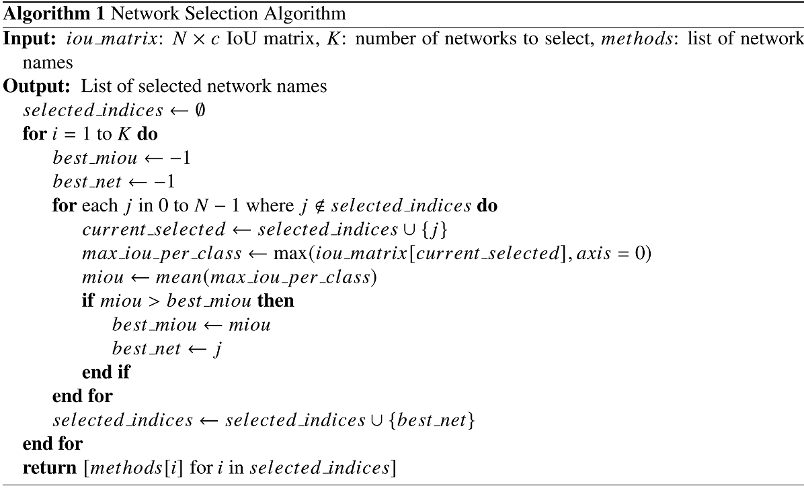
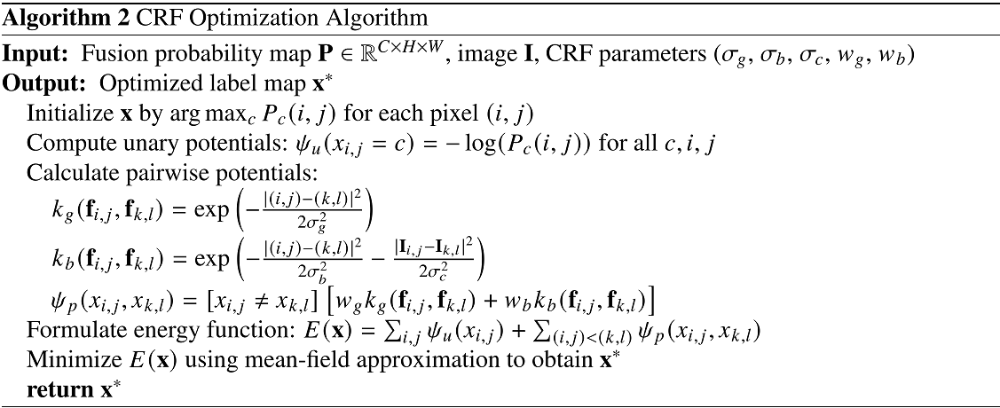
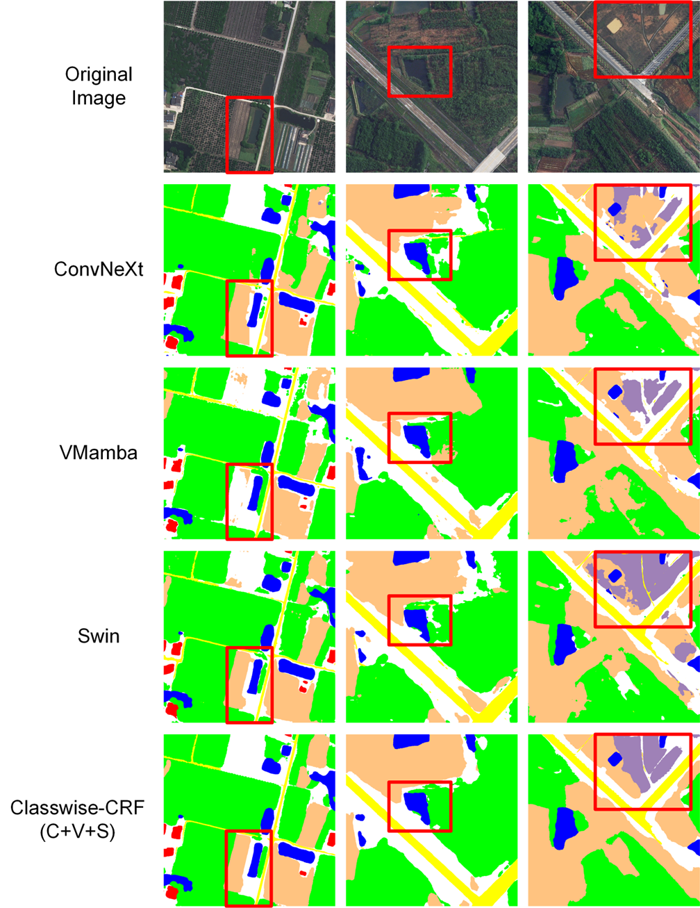

<div align="center">

# ClassWise-CRF  
### Category-Specific Fusion + CRF Refinement for Remote Sensing Semantic Segmentation

<p>
  
  
  
  
  
</p>

**Paper:** *ClassWise-CRF: Category-Specific Fusion for Enhanced Semantic Segmentation of Remote Sensing Imagery*  
Accepted by *Neural Networks* (DOI forthcoming).  
arXiv: https://arxiv.org/abs/2504.21491

</div>

---

## ✨ What is ClassWise-CRF?

Different segmentation backbones are often **good at different classes**. ClassWise-CRF is a **result-level** framework that:

1) **selects a small set of “expert” models** from a candidate pool (greedy selection),  
2) **fuses their probability maps** using **class-wise exponential weights** (validation IoU as priors),  
3) **refines the fused map** with **Dense CRF** (unary + pairwise potentials) to improve **spatial consistency** and **boundary accuracy**.

This design improves overall mIoU on common remote sensing benchmarks (LoveDA / Vaihingen) while staying **architecture-agnostic** (CNN / ViT / Mamba etc.).

> [!NOTE]
> This repo focuses on **fusion & refinement**. You can use your own trained models as long as you can export per-class probability maps.

---

## 🔥 Highlights

- **Category-specific expert fusion** (each class is dominated by its best expert).  
- **Exponential weighting** with a single hyperparameter **α** (typical range **[1.0, 3.0]**).  
- **Dense CRF optimization** for sharper boundaries and cleaner regions.  
- **Reported gains** (over best baseline):
  - LoveDA: **+1.00 mIoU (val)**, **+0.68 mIoU (test)**  
  - Vaihingen: **+0.87 mIoU (val)**, **+0.91 mIoU (test)**

---

## 🖼️ Project Gallery


<p align="center">
  
</p>
<p align="center"><i>Pipeline overview: expert selection → class-wise fusion → CRF refinement.</i></p>

<p align="center">
  
</p>
<p align="center"><i>Greedy expert selection (Algorithm 1): iteratively add the model that maximizes fused mIoU.</i></p>

<p align="center">
  
</p>
<p align="center"><i>Dense CRF refinement (Algorithm 2 / illustration): unary from fused probabilities + pairwise smoothing with edge-awareness.</i></p>

<p align="center">
  
</p>
<p align="center"><i>Qualitative comparisons: cleaner regions and sharper boundaries after ClassWise-CRF.</i></p>


---

## 🧭 Table of Contents

- [⚡ Quick Start](#-quick-start)
- [📦 Installation](#-installation)
- [🗂️ Dataset Preparation](#️-dataset-preparation)
- [▶️ Usage](#️-usage)
- [🧠 Method Details](#-method-details)
- [📊 Results](#-results)
- [🧩 Tips & Troubleshooting](#-tips--troubleshooting)
- [🧾 Citation](#-citation)
- [📬 Contact](#-contact)
- [📄 License](#-license)

---

## ⚡ Quick Start

> [!TIP]
> If you already have the datasets and model predictions in `DATA/`, you can run a single experiment in ~2 commands:

```bash
cd NPY_WEIGHT_E_FUSE
python 3_bayesian_loveda_e2.5.py
```

To run a batch of experiments:
```bash
python BASH.py
```

---

## 📦 Installation

**Requirements**
- Ubuntu 20.04
- CUDA 12.4

> [!NOTE]
> If you use a different CUDA/driver stack, you can still run the fusion/CRF scripts as long as your environment supports your installed dependencies.

---

## 🗂️ Dataset Preparation

LoveDA: https://github.com/Junjue-Wang/LoveDA

After downloading the dataset, place **data and predictions** under `DATA/` and keep folder names consistent with the scripts (or update paths in the scripts):

```text
DATA/
  loveda/
    ori/               # original images
    lovedagt/          # ground truth masks
    convnexttpre_npy/  # ConvNeXt predictions (.npy)
    swintpre_npy/      # Swin predictions (.npy)
    vmambatpre_npy/    # VMamba predictions (.npy)
  vaihingen/
    ori/
    vaihingengt/
    convnexttpre_npy/
    swintpre_npy/
    vmambatpre_npy/
```

> [!IMPORTANT]
> Many scripts use absolute paths like `/ZQFSSD/crf/DATA/...`; update those paths to your local dataset location.

---

## ▶️ Usage

### Run a single fusion script

Run individual fusion scripts from `NPY_WEIGHT_E_FUSE`:

```bash
cd NPY_WEIGHT_E_FUSE
python 3_bayesian_loveda_e2.5.py
```

### Run multiple experiments

Run multiple experiments with `BASH.py` (update the script list and log path as needed):

```bash
python BASH.py
```

---

## 🧠 Method Details

<details>
<summary><b>1) Inputs: probability maps</b></summary>

Each selected network outputs a **probability map** (not hard labels) to preserve uncertainty:

- For **K** selected networks and **C** classes, each network produces  
  **P<sub>k</sub> ∈ ℝ<sup>C×H×W</sup>**, where P<sub>k,c</sub>(i,j) is the confidence of class *c* at pixel *(i,j)*  
- Probabilities satisfy: **∑<sub>c=1..C</sub> P<sub>k,c</sub>(i,j) = 1**

</details>

<details>
<summary><b>2) Category-specific fusion (exponential weighting)</b></summary>

Use validation IoU as priors and weight each expert **per class**:

$$
w_{k,c} = \frac{IoU_{k,c}^{\alpha}}{\sum_{m=1}^{K} IoU_{m,c}^{\alpha}}
$$

Typical **α ∈ [1.0, 3.0]**:
- α = 1 → linear weighting  
- α > 1 → amplifies expert differences, boosting the best expert per class

Then fuse the probability maps class-wise:
$$
P_c(i,j) = \sum_{k=1}^{K} w_{k,c}\,P_{k,c}(i,j)
$$

</details>

<details>
<summary><b>3) Dense CRF refinement</b></summary>

CRF refines the fused probability map to improve spatial consistency and boundaries.

Unary term from fused probability:
$$
\psi_u(x_{i,j}=c) = -\log(P_c(i,j))
$$

Pairwise term uses Gaussian + bilateral kernels (edge-aware smoothing), optimized via mean-field iterations (see paper).

</details>

<details>
<summary><b>4) Notes on Bayesian optimization overhead</b></summary>

CRF hyperparameters can be tuned on the validation set (one-time cost).  
Example report: each optimization trial ~36s on RTX 3090; 20 trials ~721s.

</details>

---

## 📊 Results

ClassWise-CRF improves segmentation performance on **LoveDA** and **Vaihingen** (validation & test).

> If you’d like, insert your paper tables as images here:
> - `assets/table_loveda.png`
> - `assets/table_vaihingen.png`

<p align="center">
  
</p>

---

## 🧩 Tips & Troubleshooting

### Fixing absolute paths

If scripts contain hard-coded paths like `/ZQFSSD/crf/DATA/...`, you can:

- **Option A (recommended):** search & replace in the repo:
  ```bash
  grep -R "/ZQFSSD/crf/DATA" -n .
  ```
  then edit those files to your local `.../DATA` folder.

- **Option B:** create a symlink so the absolute path resolves:
  ```bash
  sudo mkdir -p /ZQFSSD/crf
  sudo ln -s /path/to/your/repo/DATA /ZQFSSD/crf/DATA
  ```

### My .npy format doesn’t match
Ensure each prediction is a per-class probability map (C×H×W) and normalized per pixel.

---

## 🧾 Citation

Zhu, Qinfeng, Yunxi Jiang, and Lei Fan. "ClassWise-CRF: Category-Specific Fusion for Enhanced Semantic Segmentation of Remote Sensing Imagery." arXiv preprint arXiv:2504.21491 (2025).

```bibtex
@article{zhu2025classwise,
  title={ClassWise-CRF: Category-Specific Fusion for Enhanced Semantic Segmentation of Remote Sensing Imagery},
  author={Zhu, Qinfeng and Jiang, Yunxi and Fan, Lei},
  journal={arXiv preprint arXiv:2504.21491},
  year={2025}
}
```

---

## 📬 Contact

- Lei Fan (corresponding): Lei.Fan@xjtlu.edu.cn

---

## 📄 License

See `LICENSE`.

